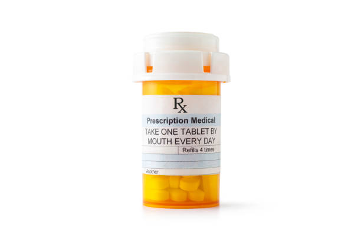
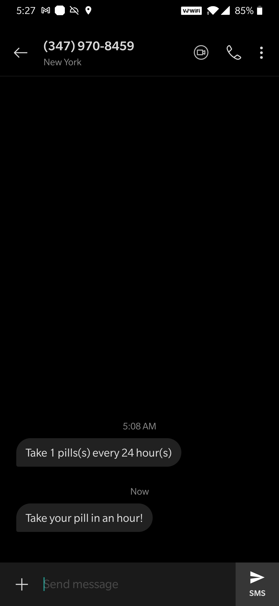

# Pillminder

### Presentation & Demo
- Link to <a href="https://www.youtube.com/watch?v=Uqb9mhVVuMo&feature=youtu.be&ab_channel=LaxitShahi" target="_blank">Video Presentation</a>

### Inspiration 
On average, people use 5 or more prescription drugs, everyday. Keeping track of all those prescriptions is a hassle. Because of this, we have developed Pillminder as a solution to this problem.

### What it does
When a user logs into their Pillminder account, they can upload an image or take a photo of their medication prescription, giving it a title and choosing how they want to receive their notification.

### How we built it
We used JavaScript, React, and Ant Design for the frontend, and Firebase and Node.js for the backend. When a user signs up, their credentials are stored into Firebase Authentication and Firebase Cloud Firestore. Adding a new reminder stores the image into Firebase Cloud Storage, with the URL, the title, and the notification setting being saved into Firestore. We utilized the Google Cloud Vision API to extract text from images, with our own functions to process the text into readable messages, and the Twilio API to send the message to the user's phone number.

    
    

        An example of an ideal picture of a capsule bottle to use
    

    
    

        Our app would extract text from the capsule and send you a text to Pillmind you :)
    

## Contributors

- [Lawrence Lin]
- [Laxit Shahi]
- [Alain Ballen]
- [Xuejin Gao]

[Lawrence Lin]: https://www.linkedin.com/in/lawrencelin101/
[Laxit Shahi]: https://www.linkedin.com/in/laxitshahi/
[Alain Ballen]: https://www.linkedin.com/in/alain-ballen/
[Xuejin Gao]: https://www.linkedin.com/in/xuejingao
